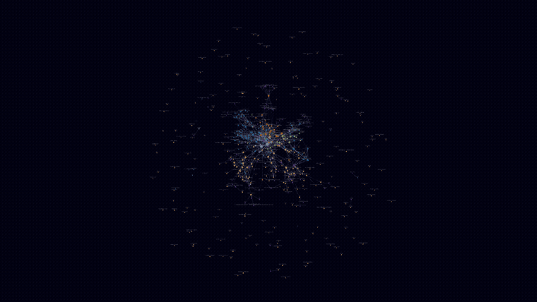
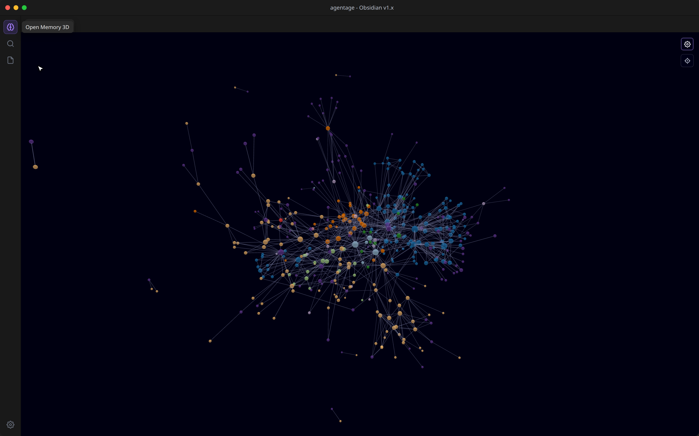
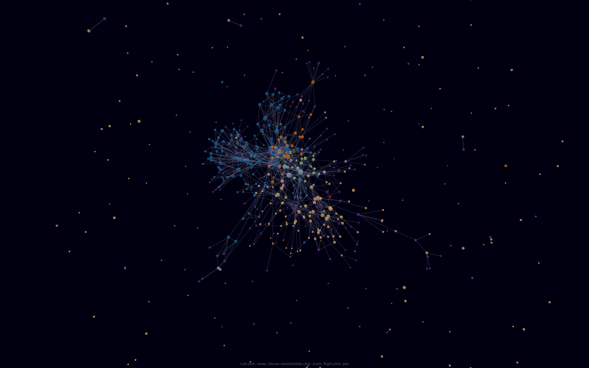

# Agentage Galaxy

> Your vault, in three dimensions.

See your vault as a 3D, rotating force-graph. Notes are nodes, `[[links]]` are edges, and
folders form colored clusters you can search, filter, and orbit. Click the **brain** ribbon
icon and fly through your knowledge.

## Install

### Community plugins (recommended)

**[→ Open in Obsidian](obsidian://show-plugin?id=agentage-galaxy)** — one-click, opens the plugin page in your Obsidian app (or copy `obsidian://show-plugin?id=agentage-galaxy`).

Or from inside the app: Settings → **Community plugins** → **Browse** → search **"Agentage Galaxy"** → **Install** → **Enable**.

### Manual

Download `main.js`, `manifest.json`, and `styles.css` from the
[latest release](https://github.com/agentage/obsidian-galaxy/releases/latest) into
`<your-vault>/.obsidian/plugins/agentage-galaxy/`, then enable it under Community plugins.

Then click the **brain** icon in the left ribbon (or run the **Open 3D graph** command).

## Features

- **Auto-clustered by folder, zero config** - every top-level folder gets its own color, so
  the structure of your vault pops on first open. Tags, attachments, and unresolved `[[links]]`
  each form their own colored group. No `path:`/`tag:` rules to hand-write.
- **Size by connections** - your hub notes are visibly the biggest stars.
- **It's the built-in graph view, in 3D** - the same node kinds and the same filters (search,
  tags, attachments, existing-files-only, orphans), so there's nothing new to learn.
- **Full force controls** - center, repel, link, and link distance, plus node size, link
  thickness, labels, and arrows, in the gear-toggled panel.
- **Fly through it** - auto-orbit with speed control; left-drag to rotate, scroll to zoom
  toward your cursor, right-drag to pan, click a node to open it, center button to reframe.
- **100% local** - a pure offline visualization of the files you own. Zero network calls.

## Privacy

Agentage Galaxy runs **entirely on your device and makes zero network calls** - a pure,
offline visualization of the Markdown you already own. (The agentage Memory cloud service
below is a separate, optional product.)

Desktop only (`isDesktopOnly: true`): it renders with WebGL/three.js.

## Part of agentage Memory

This plugin visualizes your local vault. It's part of **[agentage Memory](https://agentage.io)** -
a shared memory layer for every AI: one set of plain-Markdown notes that Claude, ChatGPT,
Cursor, and any MCP client can read and write, mirrored locally as files you own.

> **One memory. Every AI. Owned by you.**

- Connect any AI over the Model Context Protocol at **[memory.agentage.io](https://memory.agentage.io)**
  (`https://memory.agentage.io/mcp` - Streamable HTTP + OAuth 2.1).
- The companion **[Agentage Sync](https://github.com/agentage/obsidian-sync)** plugin keeps
  your vault in sync with your private memory - this plugin gives you a 3D view of it.

→ **Learn more at [agentage.io](https://agentage.io).**

## Credits

Built on [three.js](https://github.com/mrdoob/three.js),
[3d-force-graph](https://github.com/vasturiano/3d-force-graph), and
[three-spritetext](https://github.com/vasturiano/three-spritetext). See
[THIRD-PARTY-NOTICES.md](THIRD-PARTY-NOTICES.md).

## License

MIT - see [LICENSE](LICENSE). Made by [agentage](https://agentage.io).
